# TravelMemory – MERN Application

## Hero Vired – Cloud Deployment Project

TravelMemory is a MERN stack application that allows users to browse and add travel experiences.

This project was deployed on AWS using an **Application Load Balancer, Target Group, and two EC2 instances**. Each EC2 instance runs the React frontend, Node.js backend, and Nginx.

---

## Technology Stack

- **Frontend:** React.js
- **Backend:** Node.js, Express.js
- **Database:** MongoDB Atlas
- **Web Server / Reverse Proxy:** Nginx
- **Cloud Platform:** AWS
- **Compute:** Amazon EC2
- **Load Balancing:** Application Load Balancer
- **Version Control:** Git / GitHub

---

# AWS Deployment Architecture

The final deployment consists of two EC2 instances behind a single Application Load Balancer.

```text
                         Internet
                            |
                            v
              Application Load Balancer
                            |
                            v
                      Target Group
                       /          \
                      /            \
                     v              v
              EC2 Instance 1   EC2 Instance 2
                 |                  |
              Nginx :80          Nginx :80
                 |                  |
           React :3000          React :3000
                 |                  |
          Node.js :3001       Node.js :3001
                 \                  /
                  \                /
                   \              /
                    v            v
                    MongoDB Atlas
```

### Request Flow

```text
Browser
   ↓
Application Load Balancer :80
   ↓
Target Group
   ↓
Healthy EC2 Instance
   ↓
Nginx :80
   ↓
React Frontend :3000
   ↓
Node.js Backend :3001
   ↓
MongoDB Atlas
```

---

# 1. MongoDB Atlas

MongoDB Atlas is used as the managed database service for the TravelMemory application.

The backend connects to the Atlas database using environment variables configured on the EC2 instances.

Sensitive information such as database usernames, passwords, and connection strings is not included in this repository.

### MongoDB Atlas Cluster

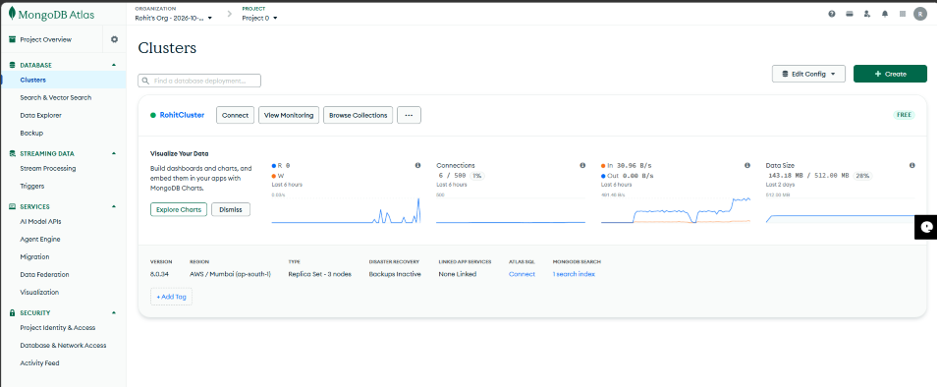

---

### MongoDB Atlas Network Access

Network access was configured according to the deployment requirements.

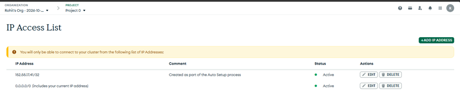

---

# 2. EC2 Infrastructure

Two EC2 instances are used to provide the application services.

Each instance contains:

| Service | Port | Purpose |
|---|---:|---|
| Nginx | 80 | Web-facing service |
| React | 3000 | Frontend application |
| Node.js | 3001 | Backend API |
| MongoDB Atlas | External | Managed database |

### EC2 Instances

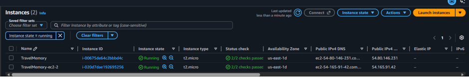

---

# 3. Backend Deployment

The Node.js backend provides the API for the TravelMemory application.

The backend:

- Runs on each EC2 instance
- Listens on port **3001**
- Connects to MongoDB Atlas
- Handles application API requests
- Is managed as a persistent service using systemd

### Backend Service

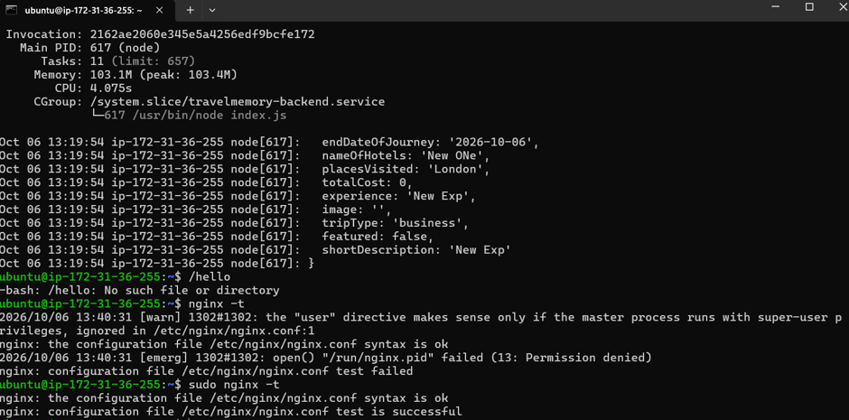

---

# 4. Nginx Configuration

Nginx is configured on each EC2 instance and listens on port **80**.

It acts as the web-facing layer between the Application Load Balancer and the application running on the EC2 instance.

The deployed application uses:

```text
Nginx      → :80
React      → :3000
Node.js    → :3001
```

### Nginx / Application Verification

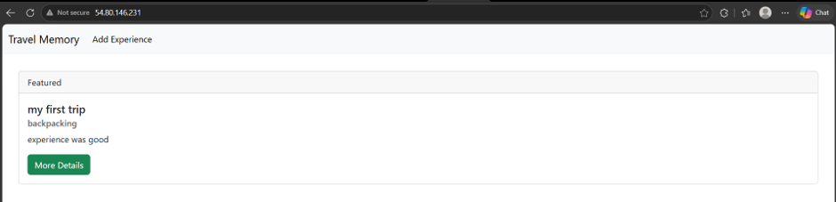

---

# 5. Frontend Deployment

The TravelMemory React frontend is deployed on each EC2 instance.

The frontend communicates with the Node.js backend using the configured backend URL.

The React application runs on port **3000**.

### Frontend Application

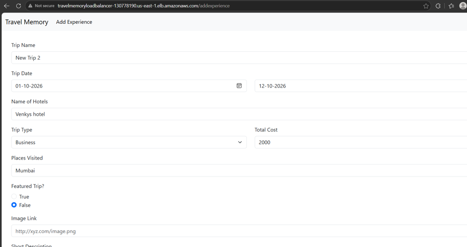

---

# 6. Application Verification

The application was tested after deployment.

The following functionality was verified:

- TravelMemory homepage loads successfully
- Existing travel experiences are displayed
- A new experience can be added
- The new experience remains after refreshing the page
- Backend API responds successfully
- Database persistence works correctly

### Application Test

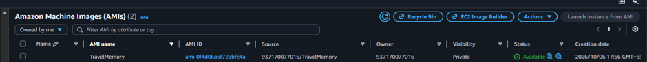

---

# 7. Amazon Machine Image

After configuring and testing the first EC2 instance, an Amazon Machine Image (AMI) was created.

The AMI preserves the validated application server configuration and was used to launch the second EC2 instance.

### AMI

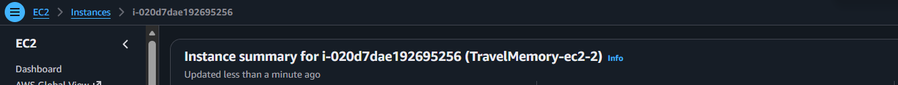

---

# 8. Second EC2 Instance

The second EC2 instance was launched using the prepared AMI.

This provides two application servers with the same deployment configuration.

### Second EC2 Instance

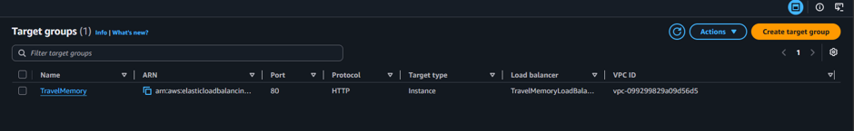

---

# 9. Target Group

Both EC2 instances were registered with an AWS Target Group.

The target group performs health checks to determine whether each instance is available to receive traffic.

The final configuration contains two healthy targets.

### Target Group – Healthy Targets

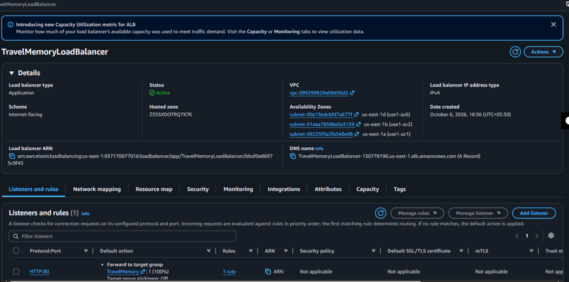

---

# 10. Application Load Balancer

An internet-facing Application Load Balancer provides the public entry point for the TravelMemory application.

The ALB:

- Accepts HTTP traffic on port 80
- Forwards requests to the target group
- Routes traffic to healthy EC2 instances
- Provides a single endpoint for accessing the application

### Application Load Balancer

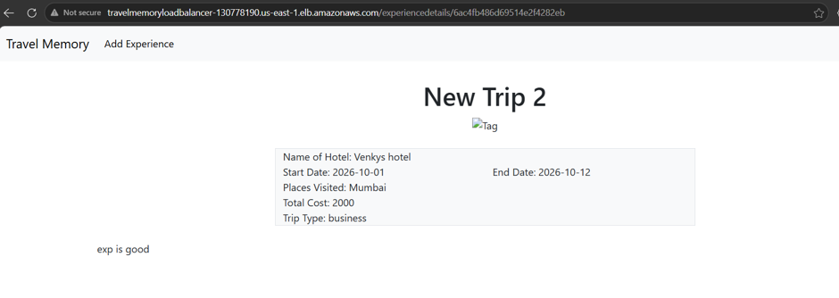

---

# 11. Final Application Test

The final application was accessed through the **Application Load Balancer DNS endpoint**.

The complete application flow was successfully verified.

### Final Result

- Application loaded successfully
- Travel experiences were displayed
- New experience was added successfully
- Data persisted after page refresh
- Both EC2 instances were healthy in the target group

### Final Application


---

# 12. Security

The following security practices were followed:

- MongoDB credentials are stored in environment variables.
- `.env` files are excluded from Git.
- AWS private key files (`.pem`) are excluded from Git.
- `node_modules` is excluded from Git.
- Sensitive credentials are not included in screenshots or documentation.
- The ALB provides the public entry point to the application.

---

# 13. Scalability and Resilience

The use of an Application Load Balancer and two EC2 instances provides basic scalability and resilience.

### Scalability

Additional EC2 instances can be registered with the target group when required.

### Resilience

If one EC2 instance becomes unhealthy, the Application Load Balancer can route traffic to the remaining healthy instance.

### Repeatable Deployment

The Amazon Machine Image allows another EC2 instance to be created using the validated application configuration.

---

# 14. Repository Structure

```text
TravelMemory/
│
├── backend/
│   ├── index.js
│   ├── package.json
│   └── package-lock.json
│
├── client/
│   ├── src/
│   ├── public/
│   ├── package.json
│   └── package-lock.json
│
├── images/
│   ├── image1.png
│   ├── image2.png
│   ├── image3.png
│   ├── ...
│   └── image12.png
│
├── .gitignore
└── README.md
```

---

# 15. Sensitive Files Excluded

The following files and folders must not be committed to GitHub:

```text
.env
*.pem
node_modules/
build/
dist/
```

The repository contains source code and deployment information only. Credentials and private keys are intentionally excluded.

---

# 16. Project Documentation

Detailed deployment documentation containing the complete deployment process and supporting screenshots is provided separately as part of the Hero Vired project submission.

The documentation covers:

- MongoDB Atlas configuration
- EC2 setup
- Backend deployment
- Frontend deployment
- Nginx configuration
- AMI creation
- Second EC2 launch
- Target Group configuration
- Application Load Balancer
- Final application testing
- Architecture

---

# 17. Deployment Result

The TravelMemory MERN application was successfully deployed on AWS using two EC2 instances behind an Application Load Balancer.

The final architecture is:

```text
Internet
   ↓
Application Load Balancer
   ↓
Target Group
   ↓
EC2 Instance 1 + EC2 Instance 2
   ↓
Nginx :80
   ↓
React :3000
   ↓
Node.js :3001
   ↓
MongoDB Atlas
```

The deployed application was successfully tested through the ALB endpoint, including creating a new travel experience and confirming that the data remained available after refreshing the application.

---

# Author

**Rohit Dhaware**

**Project:** TravelMemory – MERN Application  
**Program:** Hero Vired – Cloud Deployment
